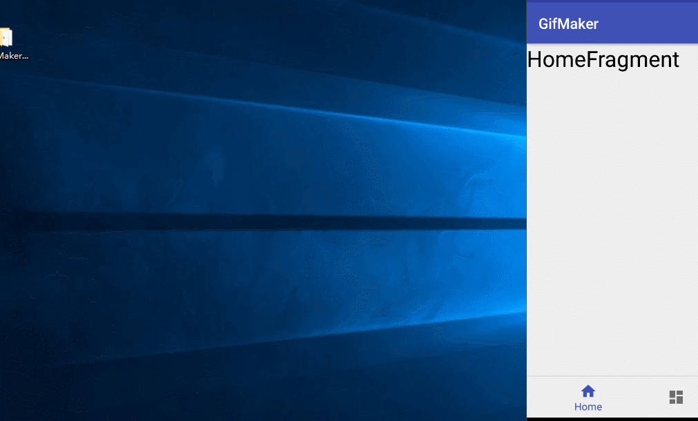
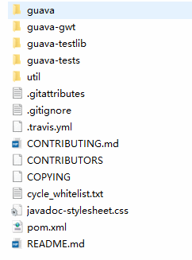
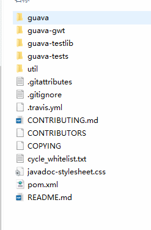
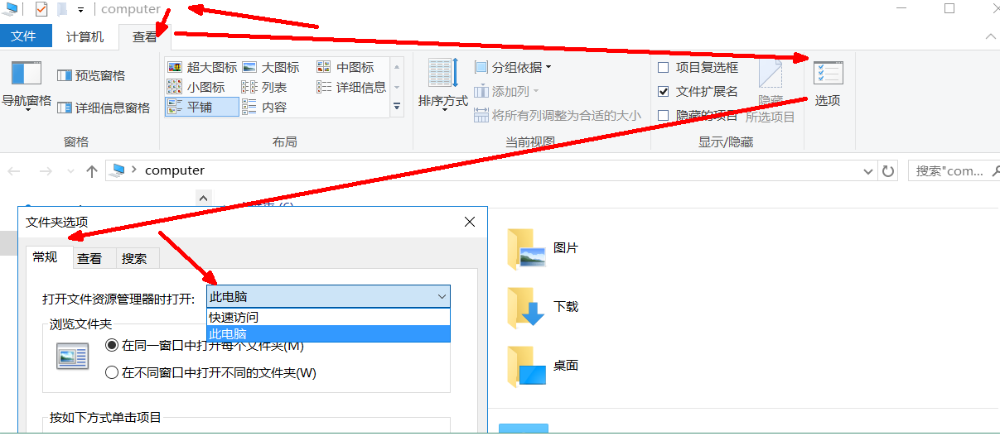
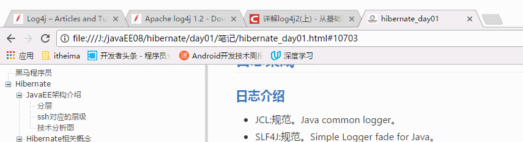

##window中常用快捷键

alt+F4---最常用的快捷键,关闭程序窗口

alt+tab---切换已经打开的程序/窗口;在按住alt不放手,单击tab后会出现已打开窗口的列表,可以通过鼠标点击切换窗口

alt+←---在已打开的文件夹中按下该快捷键,回到上一个目录

alt+→---在已打开的文件夹中按下该快捷键,去到下一个目录

ctrl+a---全选(不论是文本内容还是选择文件/文件夹)

ctrl+c---复制(保留原来内容)

ctrl+x---剪切(不保留原来内容)

ctrl+v---黏贴

ctrl+z---撤销上一次操作

ctrl+鼠标多次点击文件/文件夹---不需要按顺序的选中多个文件

shift+鼠标点击文件/文件夹---按顺序的选中开始至结尾文件

win+e---打开资源管理器(win10打开的会是我的文档还是啥,用下面这个设置方式更改连接)

win+r---打开"运行"窗口

在运行窗口输入文件夹全路径可以快速打开文件夹

##在浏览器中的常用快捷键

ctrl+t---新建标签页

ctrl+w---关闭当前标签页(也可以用来关闭window中的文件夹)

ctrl+tab---在有标签页的情况下依次切换标签

ctrl+r---强制刷新当前页面

space(空格键)---下一页

page down---下一页

page up---上一页

